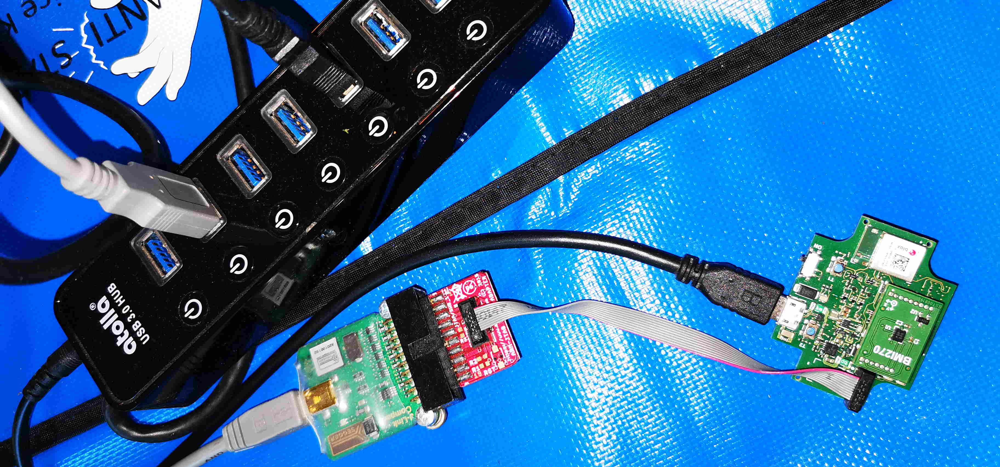

# Rust driver for BMI270 IMU Sensor

## Overview

This is a pilot Rust driver and sample application for the Bosch Sensortec BMI270 IMU sensor. It is designed for Rust RTOS Embassy, but can be easily ported to other Rust RTOS.
It is adapted from the BMI270 driver for Zephyr (written in C) and incorporates a part of the Zephyr Sensor API adapted for Rust.
It is designed for the Bosch Sensortec Application Board 3.0 mounted with a BMI270 shuttle board, but can be easily adapted to other boards.

**Please Note:** This is a pilot project to explore the possibility of using Rust for development on Bosch Sensortec hardware platforms. It is NOT meant for production use.

## Hardware Setup

Hardware Requirement: 
1. Bosch Sensortec Application Board 3.0 (APP30)
2. BMI270 Shuttle Board
3. Segger J-Link Probe

Mount the BMI270 shuttle board on APP30. Connect APP30 and the J-Link probe to the host PC via usb. Connect the J-Link probe to APP30 debug port.



## Software Setup
1. Install Rust https://www.rust-lang.org/tools/install
2. Install the Embassy RTOS https://github.com/embassy-rs/embassy and dependencies.
3. Clone this repository in your project folder.
4. Optionally Install VSCode and install the Rust Analyzer plugin https://code.visualstudio.com/docs/languages/rust

## Building and Running
Open a console app (or use the inbuilt console in VS Code), change directory to the path where this project has been cloned, and give the following command:

```
cargo build
```
This will build an elf file named accel (the name of the sample project) in *./target/thumbv7em-none-eabihf/debug/* .  If the build is successful, run the sample application with the command :

```
cargo run
```

This will flash the elf file on the target using the *probe-rs* toolkit (which was installed as a part of the Embassy installation) via the jlink debug probe and reset the MCU. If all goes well, the readings from the BMI270 accelerometer and gyroscope will be dumped every 3 seconds using the *defmt-rtt* logger, along with various debug information:

```

└─ accel::app30_spi::{impl#1}::read @ src\app30_spi.rs:90
10.909454 <lvl> Accel: (-0.7781,-2.258399, 9.610618) Gyr: ( 0.2396, 0.7190,-0.798)

└─ accel::accel_main @ src\main.rs:114
13.910461 INFO  app30_spi_read
└─ accel::app30_spi::{impl#1}::read @ src\app30_spi.rs:79
13.910614 INFO  exit app30_spi_read tx [8c] data [e2, ff, 5f, f1, bc, 3e, 08, 00, 1b, 00, 00, 00]

└─ accel::app30_spi::{impl#1}::read @ src\app30_spi.rs:90
13.911132 <lvl> Accel: (-0.17957,-2.241639, 9.613013) Gyr: ( 0.2130, 0.7190, 0.0)

└─ accel::accel_main @ src\main.rs:114
16.912139 INFO  app30_spi_read
└─ accel::app30_spi::{impl#1}::read @ src\app30_spi.rs:79
16.912292 INFO  exit app30_spi_read tx [8c] data [fb, ff, 46, f1, c4, 3e, 09, 00, 17, 00, 03, 00]

└─ accel::app30_spi::{impl#1}::read @ src\app30_spi.rs:90
16.912811 <lvl> Accel: (-0.2992,-2.256603, 9.617801) Gyr: ( 0.2396, 0.6125, 0.798)
```
**NOTE**

Embassy uses the *probe-rs* toolkit to flash and debug the embedded application via the Segger-J-Link probe. *probe-rs* uses the WinUSB driver to connect to the J-Link probe. If JLink.dll is installed on the host computer, which would be the case if the Segger software had been previously installed, *probe-rs* will not work. In this case, it is necessary to use the Zadig2.8 tool to remove JLink.dll and install WinUSB. This is explained here https://probe.rs/docs/getting-started/probe-setup/#windows%3A-winusb-drivers

When you do *cargo run*, the error message will provide the necessary details for carrying out the above steps.

Note that you will need to use the Segger tool "J-Link DLL Update" to revert to JLink.dll, in order to use Segger tools in the usual fashion.

If you wish to avoid doing this, it is possible to flash and run the accel elf file on the target using the Segger tool *nrfgprog.exe* in the usual way:

´´´
copy /y target\thumbv7em-none-eabihf\debug\accel accel.elf 
nrfjprog --sectoranduicrerase -f NRF52 --program accel.elf 
nrfjprog --pinresetenable -f NRF52
nrfjprog --pinreset -f NRF52

´´´
However, Segger tools like J-Link viewer cannot currently view the log output from the Embassy application which uses the *defmt-rtt* protocol which is used by Embassy for logging. A workaround may be possible. I am still exploring other possibilities.

## Open Points

- Sensor Triggers are not yet supported. 
- i2c is not yet supported (only spi)
- Add support for other application boards
- Add drivers for other Bosch Sensortec sensors
- Improve the directory structure 
